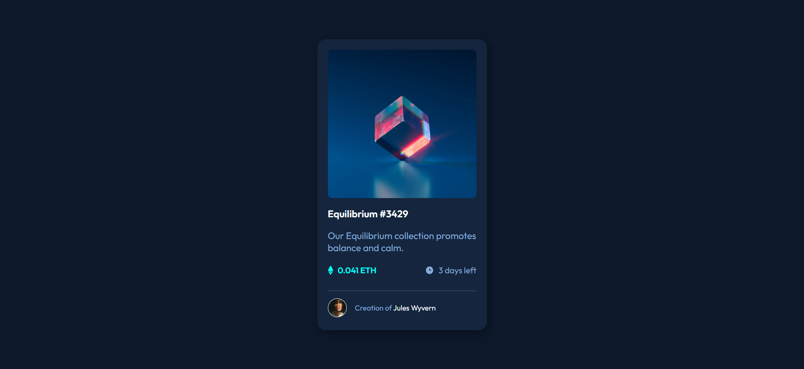
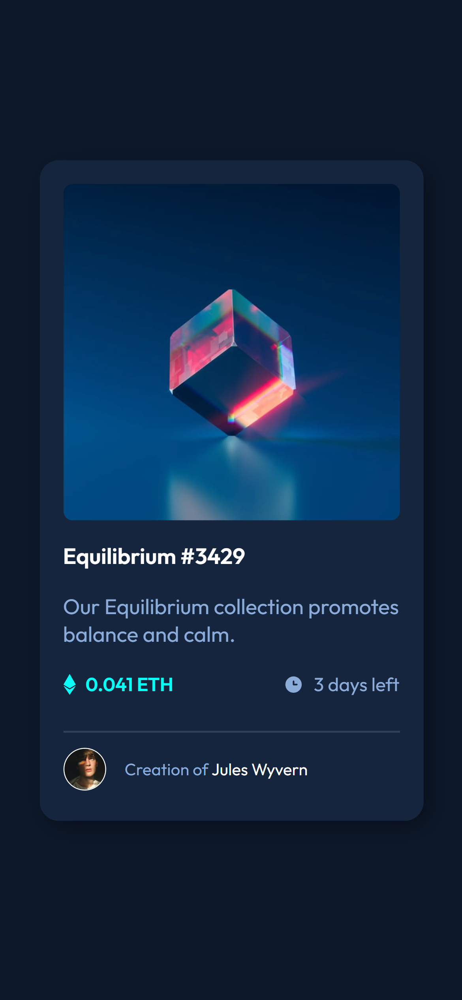

# Frontend Mentor - NFT preview card component solution

This is a solution to the [NFT preview card component challenge on Frontend Mentor](https://www.frontendmentor.io/challenges/nft-preview-card-component-SbdUL_w0U). Frontend Mentor challenges help you improve your coding skills by building realistic projects.

## Table of contents

- [Overview](#overview)
  - [The challenge](#the-challenge)
  - [Screenshot](#screenshot)
  - [Links](#links)
- [My process](#my-process)
  - [Built with](#built-with)
  - [What I learned](#what-i-learned)
  - [Continued development](#continued-development)
  - [Useful resources](#useful-resources)
- [Author](#author)
- [Acknowledgments](#acknowledgments)

## Overview

### The challenge

Users should be able to:

- View the optimal layout depending on their device's screen size
- See hover states for interactive elements

### Screenshot




### Links

- Live Site URL: [femt-nft-preview-card-component](https://mpluggie7.github.io/femt-nft-preview-card-component/)

## My process

### Built with

- Semantic HTML5 markup
- CSS custom properties
- Flexbox
- Mobile-first workflow
- [Styled Components](./style.css) - For styles

### What I learned

I've learned how to hover the picture and get another picture come overlay the before.
I've used the opacity 0 for hide the overlay and 1 for show the overlay.
The Default opacity is 0 for overlay when hover is 1.

```css
.viewImgDiv {
  width: 100%;
  height: 100%;
  border-radius: 8px;
  position: absolute;
  top: 0;
  left: 0;
  background-color: var(--Cyan2);
  opacity: 0;
  cursor: pointer;
}

.viewImgDiv:hover {
  opacity: 1;
}
```

### Continued development

n/a

### Useful resources

n/a

## Author

- Website - [megamaxo-app](https://www.megamaxo-app.com)
- Frontend Mentor - [@Mpluggie7](https://www.frontendmentor.io/profile/Mpluggie7)

## Acknowledgments
